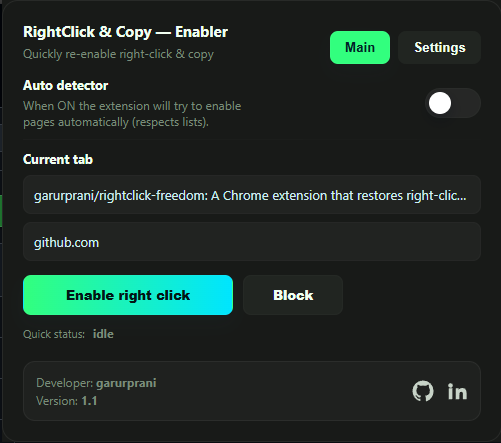
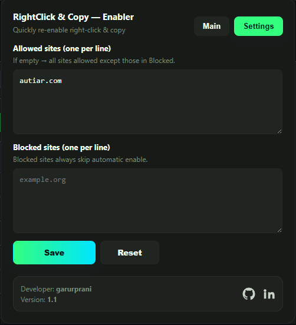

# RightClick Freedom

A simple Chrome extension that unlocks right-click, copy, and text selection on websites that block these features. Made for students, researchers, and anyone who needs to copy content from restrictive websites.

## ✨ What It Does

- **Unlocks right-click** on sites that disable context menus
- **Enables copy/paste** where blocked
- **Auto-detects** restrictive sites (optional)
- **Manual control** per site via popup
- **Whitelist/Blacklist** system for fine control
- **One-click enable** on any tab

## 📸 Screenshots

| Main Interface | Settings Panel |
|----------------|----------------|
|  |  |

## Installation

### From Chrome Web Store (Coming Soon)
*(No money to pay Registration fee)*

### Manual Installation (Developer Mode)
1. **Download** or clone this repository
2. Open Chrome and go to `chrome://extensions/`
3. Enable **"Developer mode"** (toggle in top-right)
4. Click **"Load unpacked"**
5. Select the folder containing these files

## How to Use

### Basic Usage:
1. Click the extension icon in your toolbar
2. See current tab info in the popup
3. Click **"Enable Now"** to unlock right-click on that tab
4. The site will be automatically added to your allowed list

### Advanced Features:
- **Auto Mode**: Toggle ON to automatically unlock restrictive sites
- **Block Sites**: Use the "Block Site" button for sites you don't want to auto-unlock
- **Custom Lists**: Manage allowed/blocked domains in Settings
- **Reset**: Restore default settings anytime

## 📁 Files Explained
📁 extension-folder/
├── manifest.json -Extension configuration
├── popup.html - Popup interface
├── popup.js - Popup functionality
├── background.js - Background auto-detection
├── content_script.js - The magic that unlocks sites
└── styles.css - UI styling
## 🛠️ How It Works (Technical Stuff)

### The Content Script (`content_script.js`):
1. Injects CSS to override `user-select: none` styles
2. Removes `oncontextmenu` attributes from elements
3. Nulls out JavaScript context menu handlers
4. Adds event listeners to prevent blocking behaviors
5. Cleans up inline styles that disable interaction

### Auto-Detection (`background.js`):
- Listens for page loads
- Checks against your allowed/blocked lists
- Injects unlock script automatically when needed

### Storage:
- Settings saved in Chrome's sync storage
- Lists persist across devices (if signed into Chrome)

## 🤝 Contributing

Found a bug? Have a feature idea? I'd love your help!

1. **Fork** the repository
2. **Create** a feature branch (`git checkout -b cool-feature`)
3. **Commit** your changes (`git commit -m 'Add awesome feature'`)
4. **Push** to your branch (`git push origin cool-feature`)
5. **Open** a Pull Request

### Areas Where I Need Help:
- **CSS Improvements** (I'm not great at CSS - see note below)
- **Better site detection** logic
- **Additional unlock methods** for tricky sites
- **Testing** on various websites

## 📝 Note About CSS

**Full honesty time:** The CSS in this project isn't 100% my own work. I'm better at JavaScript than CSS, so I used AI tools (ChatGPT).
If you're good at CSS and can make it look better or cleaner, please help out! It works fine now, but could probably be improved.

## 🐛 Known Issues & Limitations

- **Some sites** use complex anti-copy measures that might not be fully defeated
- **Browser extensions pages** (`chrome://`) can't be modified
- **Very aggressive** copy protection might require additional methods
- **CSS overrides** might break some site layouts temporarily

## 🔒 Privacy & Security

- **No data collection** - everything stays on your browser
- **No tracking** - no analytics, no telemetry
- **Open source** - you can check all the code yourself
- **Minimal permissions** - only what's needed to work

## 📄 License

MIT License - see the LICENSE file

You can:
- Use it for anything
- Modify it
- Share it
- Make your own versions

Just give credit.

## 🙏 Credits & Thanks

- **Original idea**: Getting frustrated with websites that won't let me copy text
- **Inspiration**: Other right-click unlockers I've used
- **Everyone who tested it**: For feedback and bug reports
- **AI Tools**: For helping with the CSS parts I struggled with

## 💬 Support

Having problems?
1. Check the "Known Issues" section above
2. Try turning off other extensions that might conflict
3. Make sure Chrome is up to date
4. Open an issue on GitHub with details

---

**Made with ❤️ by someone who just wanted to copy some text for a project.**

*If this helped you, maybe give the repo a star on GitHub!*
